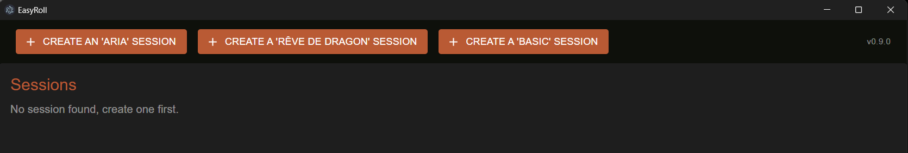
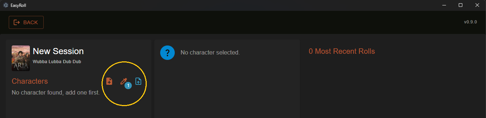
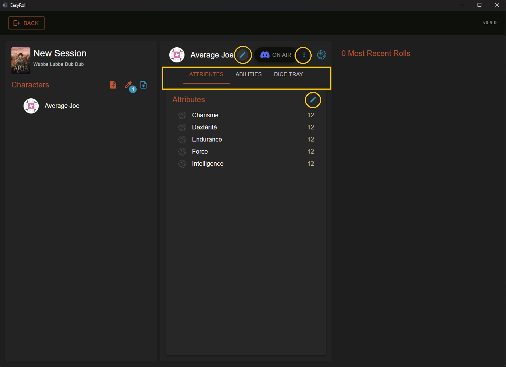

# easy-roll

### Installation

Download the latest release at https://github.com/ByGGy/easy-roll/releases/latest  
_(the installer is minimalist, you will not get a progression feedback nor be asked where you want to install the app..)_

NB: the app is not signed / notarized, therefore:
* on Windows, you will be warned and asked for an install confirmation
* on macOS, you will have to do the following (cf https://discussions.apple.com/thread/253714860?sortBy=best):
> When an application gets downloaded from any source other than those that Apple seems suited, the application gets an extended attribute "com.apple.Quarantine".  
This triggers the message: "<application> is damaged and can't be opened. You should move it to the Bin."  
Remove the attribute and you can launch the application.  
To do this, open a console and type:
```
$ xattr -c <path/to/application.app>
```

### @ Users



At the moment, two games are "supported":  
 

You should first create a new `Session` for the game relevant to you.  
Once a new session has been created, you can use it and add some characters to it:  


There is 3 options:
1. create a new character from scratch, mostly for new users
2. add an already existing character, mostly for users of `v0.3.0` and `v0.4.0`  
_(or if you want to reuse a character from another session)_
3. import a character from a JSON file  
_(probably not needed anymore, kinda deprecated..)_

Once a character has been added, select it and click one of the `pen` or `more` icons to edit its:  
* name
* attributes
* abilities
* discord configuration



NB: at the moment, it is not possible to delete a session or character.

### Links

* Aria
  * Documentation: https://foundryvtt.wiki/fr/systemes/aria

* Rêve de dragon
  * Documentation: http://www.reves-d-ailleurs.eu/jeux/reve-dragon/REVE_DE_DRAGON_2emeEd_Livre_De_Regles2.pdf

* Discord
  * API: https://discord.com/developers/docs/resources/channel#create-message
  * Auth Token format: https://discord.com/developers/docs/reference#authentication
  * How to get a Bot Token: https://www.writebots.com/discord-bot-token/
  * How to find a ChannelId: https://geekrumor.com/how-to-enable-developer-mode-in-discord-1545/